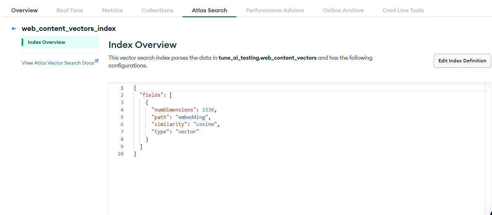

# comicGPT


## Table of Contents

- [Project Description](#project-description)
- [Tech Stack](#tech-stack)
- [Features](#features)
- [Installation](#installation)
- [Contributing](#contributing)

## Project Description

ComicGPT is a full-stack web application that serves as an interactive assistant, providing answers related to Marvel and DC Comics. Whether you're a die-hard comic fan or a casual reader, ComicGPT is here to enhance your comic book experience with in-depth knowledge and insights about your favorite characters, storylines, and universes.

## Tech Stack

List of technologies, frameworks, and tools used in this project.

- UI - Next.js (^14.0) with a structured "App" directory.
- Authentication system - uses Firebase's google-auth and sign-in-with link features
- Backend - Based on python's FastAPI 
- Database - MongoDB, used for data storage and retrieval.
- Vector DB - MongoDB Atlas Vector search index
- LLM - Supports only OpenAIs model (gpt-4o-mini,...)
- Embeddings - uses openAI Embeddings

## Features

- **Interactive Q&A:** Ask questions related to Marvel and DC Comics and get accurate and detailed answers.
- **User-Friendly Interface:** A clean and intuitive interface that makes it easy to navigate and find the information you need.
- **Universal Web Scraper:** Scrapes content from Marvel and DC Comics, converting it into vectors using OpenAI embeddings.
- **Retrieval Augmented Generation (RAG):** Uses MongoDB Atlas vector search to retrieve relevant context, enhancing the quality of answers.
- **FastAPI Backend:** The backend is powered by FastAPI, featuring inbuilt Swagger docs for easy interaction with the APIs.

## Installation

- Note: You can setup the openAI API key at the UI -> Configure Key section or in the backend
- Install Python, conda, node js and other required libraries

## Setting up the backend and DB

- Clone the Repository

```bash
 git clone https://github.com/Abdul-Maajith/ComicGPT--RAG---Full-Stack.git
 cd backend
 conda create -n tuneai python=3.10 pip
 conda activate tuneai
 pip install -r requirements.txt
```
- Create MongoDB database cluster


- Create/setup a mongoDB Atlas search index


1) Create a search index on mongoDB atlas
2) Add this into mongoDB atlat code editor:

```js
  {
  "fields": [
    {
      "numDimensions": 1536, // OpenAI Embedding
      "path": "embedding",
      "similarity": "cosine",
      "type": "vector"
    }
  ]
}
```

- Input the credentials in the .env file
- To start the server.

```bash
uvicorn main:app --reload
```

## Setting up the UI

- Before starting the server, setup the firebase instances for Authentication, copy the firebase credentials and paste it onto .env and /ui/src/config/firebaseConfig.ts

```bash

# Install dependencies
cd ui
npm install
npm run dev
```

# open-source contribtion
We welcome contributions from the community to improve LongGPT. To ensure a smooth and collaborative development process, please follow these guidelines:

## Getting Started

1. Fork the repository to your GitHub account.

2. Clone your forked repository to your local machine:

```bash
 git clone https://github.com/yourusername/your-project.git
```

3. Create a new branch for your feature development or bug fix:

```bash
 git checkout -b feature-name
```

4. To stay up to date with the main branch:

```bash
 git pull origin main
```

5. Make changes and work on your feature!

6. Commit your changes with a descriptive commit message:

```bash
 git commit -m "Add feature-name"
```

7. Creating a Pull Request (PR) and wait for Approval

# Thanks!!